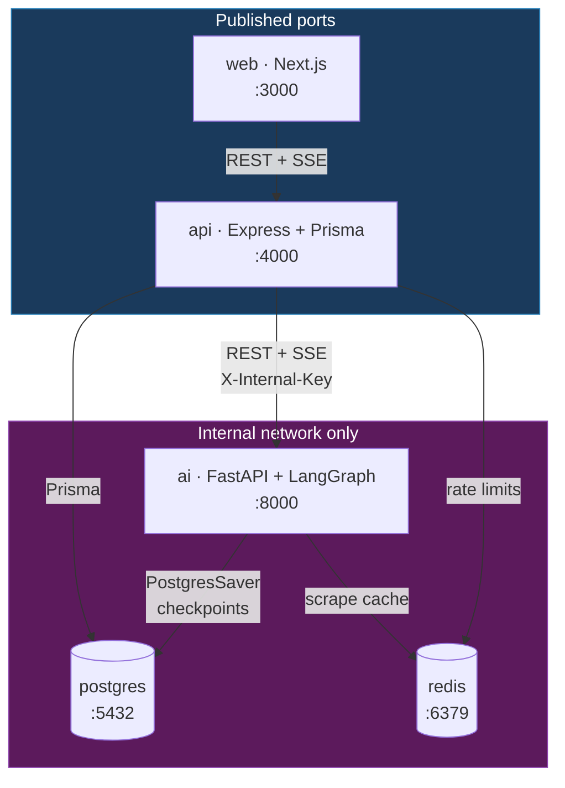
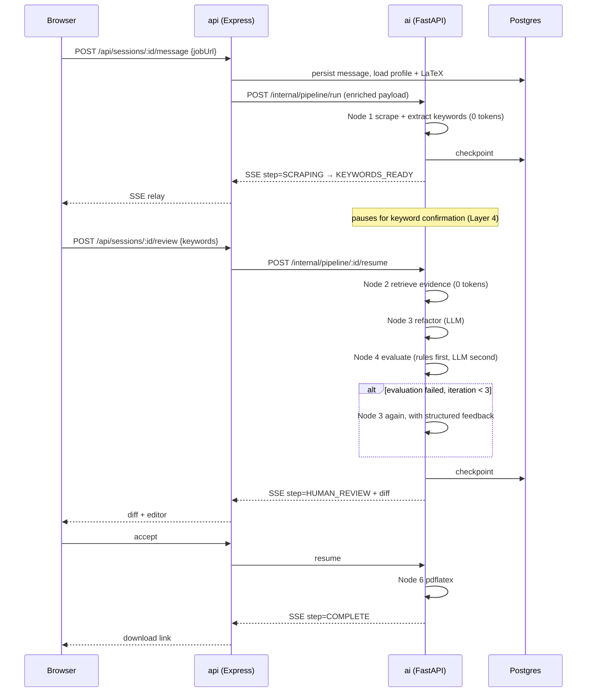

# ResumeForge — As-Built Architecture (MVP)

> **Version**: 1.0.0
> **Created**: 2026-08-20
> **Relationship to other docs**: [02-agent-architecture.md](./02-agent-architecture.md)
> is the *design* (v0.2.0, 3-repo polyrepo, Kafka evaluated). **This document is
> what is actually being built.** Where they disagree, this one is correct.

---

## 1. Deltas from the v0.2.0 design

Every change below is a deliberate MVP scope decision, not an oversight. The
reasoning for each is in [07-decision-log.md](./07-decision-log.md).

| Area | v0.2.0 design | As built | Why |
|---|---|---|---|
| Repo layout | 3 polyrepos | **1 monorepo**, 3 service directories | One CI pipeline instead of three; inter-service contracts are still real because the services are separate processes over HTTP |
| Message bus | Kafka topics | **None** — direct HTTP + SSE, Postgres checkpoints for durability | Broker overhead unjustified at single-user scale; see ADR-002 |
| LLM provider | OpenAI / Anthropic / Gemini | **Gemini** (`gemini-2.0-flash`) + deterministic mock | Free tier; provider is behind an interface so swapping is a config change |
| Auth | Google OAuth 2.0 | **Dev JWT** for a seeded user, behind real middleware | OAuth is plumbing with no bearing on the pipeline; the seam is in place |
| GitHub | OAuth app + repo scope | **Personal access token** | Same data, none of the OAuth dance |
| Frontend | ChatGPT-like chat UI + session sidebar | **One focused flow page** | The flow is a wizard, not a conversation; chat UI was costing days for no functional gain |
| Job queue | BullMQ / asyncio queue | **Synchronous graph run + SSE progress** | LangGraph already checkpoints; a queue adds a moving part with no MVP benefit |
| File storage | S3 / MinIO | **Container volume** | One less service; the S3 seam is a single function |

---

## 2. Service topology



**The trust boundary is the point.** `ai` is never published. It accepts requests
only from `api`, authenticated with `INTERNAL_API_KEY`. The browser cannot reach
it, so the AI service does not need to know what a user session is — it takes a
`thread_id` and a payload.

### Why the gateway exists

| Reason | Detail |
|---|---|
| Auth centralisation | Only `api` validates user JWTs |
| Data enrichment | `api` attaches the profile and LaTeX template before forwarding, so `ai` needs no user table access for the request path |
| Protocol isolation | The browser's SSE connection terminates at `api`; `ai`'s SSE stream is internal |
| Blast radius | An LLM-prompt-injection bug in `ai` cannot reach the user database directly |

---

## 3. Request path: URL → PDF



**Two interrupt points**, both durable: keyword confirmation and final review.
State sits in Postgres between them, so the gap can be minutes or a server
restart.

---

## 4. Where determinism is enforced

This is the architectural spine of the project and the answer to "how do you stop
the LLM hallucinating".

```
                 ┌──────────────── zero LLM tokens ────────────────┐
job text  ──▶ scrape ──▶ extract keywords ──▶ retrieve evidence ──┐
                                                                   │
                                            ┌──────────────────────▼──────┐
                                            │ Node 3 Refactorer (LLM)     │
                                            │ sees ONLY matched evidence  │
                                            └──────────────────────┬──────┘
                                                                   │
              ┌──────── zero LLM tokens ────────┐                  │
              │ structural guardrails           │◀─────────────────┘
              │ factual guardrails (automaton)  │
              └────────────────┬────────────────┘
                               │ only what rules cannot judge
                      ┌────────▼────────┐
                      │ Node 4 LLM pass │  tone, bullet quality
                      └─────────────────┘
```

The LLM is confined to the two steps that genuinely need language ability.
Extraction, retrieval, and factual verification are all deterministic — the same
Aho-Corasick automaton that reads the job description is reused to verify that
every skill in the *generated* resume traces back to real evidence.

---

## 5. Failure model

| Failure | Mechanism | Where |
|---|---|---|
| AI process dies mid-pipeline | `PostgresSaver` checkpoint after every node; resume from `thread_id` | Part 10 |
| LLM returns bad output | Evaluator detects → feedback-driven retry, max 3, then graceful degradation | Part 7 |
| LLM API error / rate limit | `tenacity` exponential backoff, 3 attempts | `clients/llm.py` |
| No LLM credentials | Deterministic `MockProvider`, pipeline still runs | `clients/llm.py` |
| Job page unscrapable | HTTP → Playwright → manual paste | `clients/scraper.py` |
| LaTeX compile error | `.log` parsed, actionable line surfaced | Part 9 |
| Malicious LaTeX | Primitive denylist + non-root + no network + timeout | Part 9 |

Note what is *not* claimed: there is no leader election, no distributed
transaction, no cross-instance coordination. Multiple `ai` replicas can run
because each session is an independent `thread_id` row in Postgres — that is
horizontal scalability by statelessness, and it is worth describing precisely
rather than as "distributed execution".

---

## 6. Data ownership

| Store | Owner | Contents |
|---|---|---|
| Postgres — app tables | `api` via Prisma | users, profile, sessions, messages |
| Postgres — checkpoint tables | `ai` via LangGraph | serialised graph state per `thread_id` |
| Redis | both | scrape cache (TTL), rate-limit counters |
| Volume | `ai` | generated PDFs |

One database, two schemas, two owners, no shared tables. `ai` never writes to an
`api` table and vice versa — the contract between them is HTTP, not the database.
