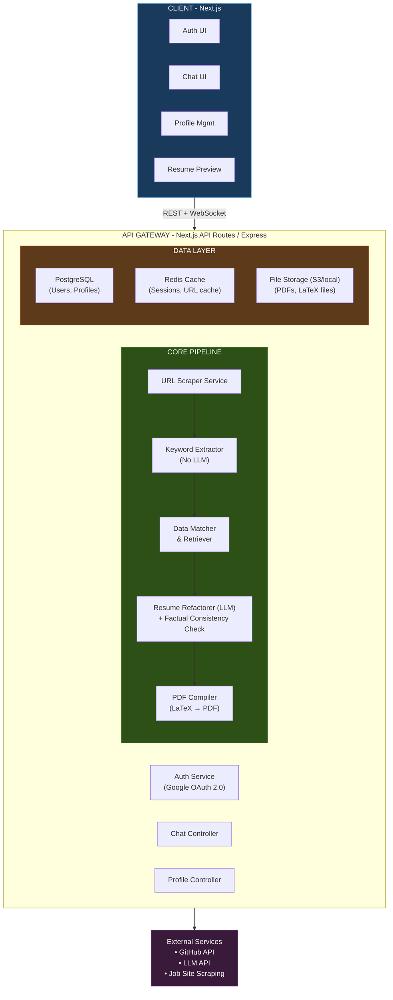
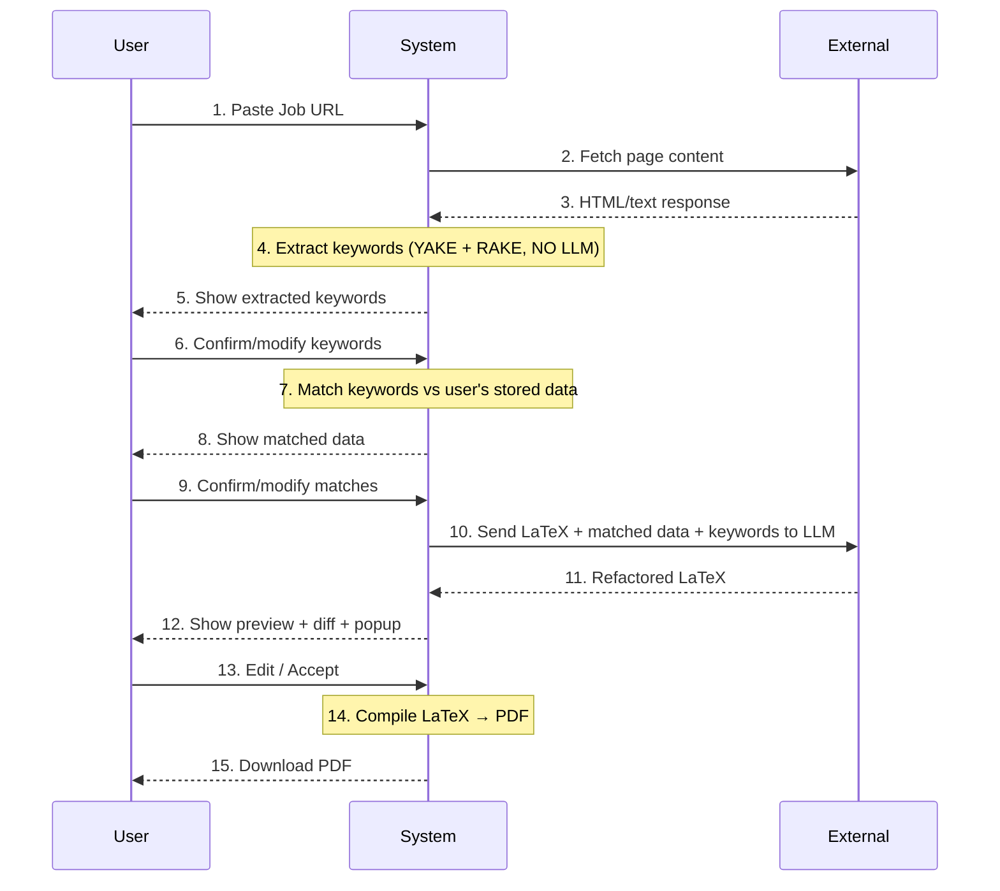
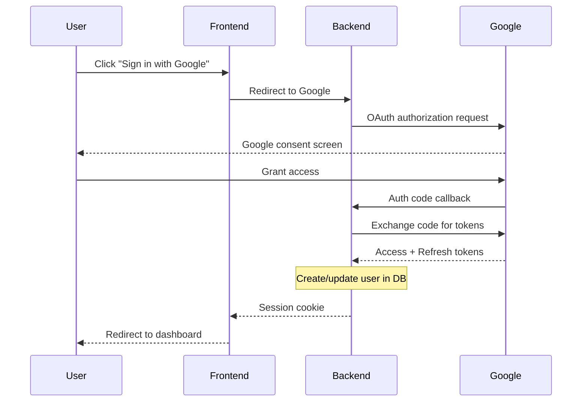
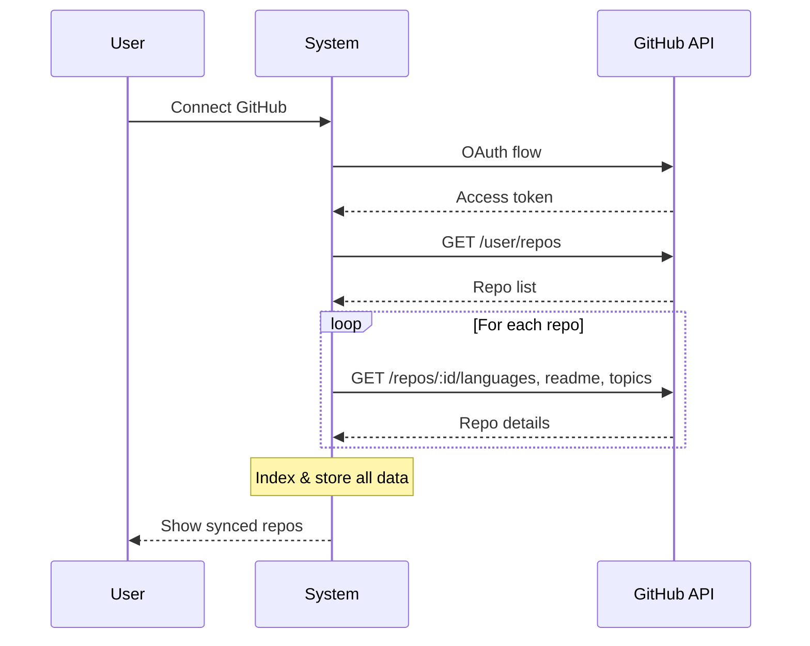
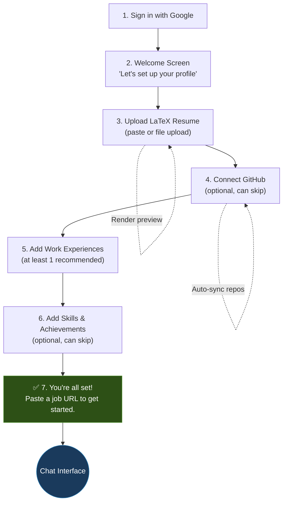
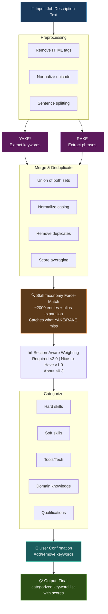
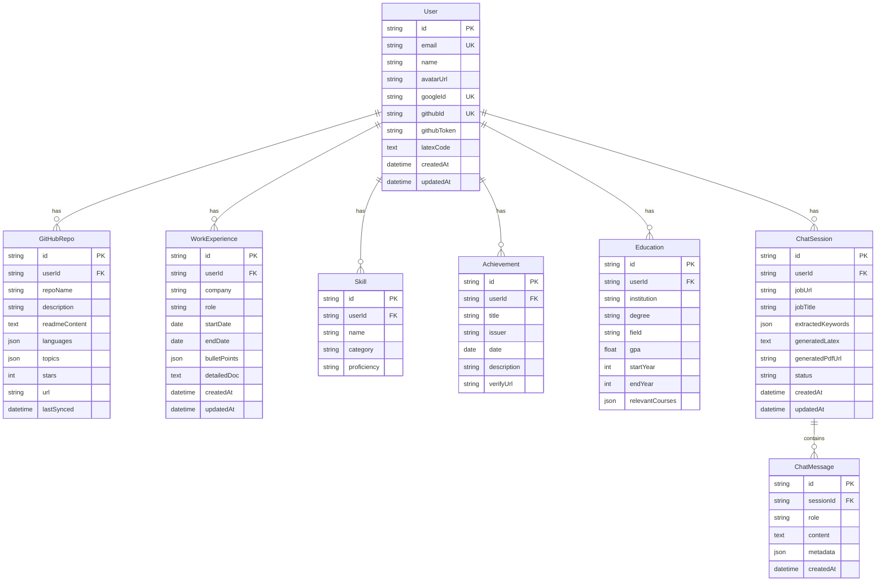

# ResumeForge — Project Requirements & Technical Design

> **Version**: 0.2.0
> **Last Updated**: 2026-07-29
> **Author**: Aditya
>
> ⚠️ **NOTE**: The architecture has been upgraded from a linear pipeline to a **LangGraph multi-agent graph**.
> See [multi_agent_architecture.md](file:///home/aditya/job-automation-project/docs/multi_agent_architecture.md) for the updated design.
> This document is preserved as the foundational reference — sections marked with ⚠️ have been superseded.

---

## Table of Contents

1. [Architecture Overview](#1-architecture-overview)
2. [Technology Stack](#2-technology-stack)
3. [System Flows](#3-system-flows)
4. [Component Deep Dives](#4-component-deep-dives)
5. [Data Models](#5-data-models)
6. [API Design](#6-api-design)
7. [Challenges & Solutions](#7-challenges--solutions)
8. [Project Structure](#8-project-structure)
9. [Deployment Strategy](#9-deployment-strategy)
10. [Development Phases](#10-development-phases)

---

## 1. Architecture Overview

> ⚠️ **SUPERSEDED**: The linear pipeline below has been replaced by a multi-agent LangGraph architecture.
> See [multi_agent_architecture.md](file:///home/aditya/job-automation-project/docs/multi_agent_architecture.md) for the current design.
> The diagram below is preserved for historical context.



### Architecture Principles

1. ~~**Pipeline-based** — The core workflow is a linear pipeline: Scrape → Extract → Match → Refactor → Compile~~ → **Updated**: Now a **LangGraph directed graph** with 5 agents, conditional edges, and self-correction loops
2. **LLM-Minimal** — LLM is invoked only at the refactoring step; everything else uses deterministic algorithms *(still true)*
3. **User-Data-Bounded** — LLM can ONLY use data from the user's profile (prevents hallucination) *(still true, now enforced by Evaluator Agent + guardrails)*
4. **Template-Preserving** — The user's LaTeX structure is treated as sacred; only content within designated sections is modified *(still true, now enforced by Template Guardrails)*
5. **Self-Correcting** — *(NEW)* Evaluator Agent validates output and routes back to Refactorer with specific fix instructions (max 3 iterations)
6. **Multi-Agent** — *(NEW)* Each agent has a single responsibility, its own prompt, and can be tested/improved independently

---

## 2. Technology Stack

### 2.1 Frontend

| Layer | Technology | Rationale |
|---|---|---|
| Framework | **Next.js 14+ (App Router)** | SSR, API routes, excellent DX, built-in routing |
| Language | **TypeScript** | Type safety across full stack |
| Styling | **Tailwind CSS + shadcn/ui** | Rapid, consistent UI development; ChatGPT-like dark UI |
| State Management | **Zustand** | Lightweight, minimal boilerplate |
| Chat UI | **Custom components** | Full control over ChatGPT-like interface |
| Code Editor | **Monaco Editor** (or **CodeMirror 6**) | LaTeX editing with syntax highlighting |
| PDF Preview | **react-pdf** or **iframe embed** | Client-side PDF rendering |
| Real-time | **WebSocket** (or SSE) | Streaming LLM responses |

### 2.2 Backend

| Layer | Technology | Rationale |
|---|---|---|
| Runtime | **Node.js 20+** | Same language as frontend, vast ecosystem |
| API Framework | **Next.js API Routes** (or **Express** if decoupled) | Co-located with frontend for simplicity in v1 |
| Language | **TypeScript** | Consistency with frontend |
| ORM | **Prisma** | Type-safe DB queries, migration management |
| Auth | **NextAuth.js (Auth.js v5)** | First-class Google OAuth, session management |
| Job Queue | **BullMQ** (Redis-backed) | Background PDF compilation, scraping jobs |
| WebSocket | **Socket.io** or **native WS** | Streaming chat responses |

### 2.3 Keyword Extraction (No LLM)

| Tool | Purpose | Rationale |
|---|---|---|
| **YAKE!** (Yet Another Keyword Extractor) | Primary keyword extraction | Unsupervised, no training needed, language-agnostic, fast, no LLM tokens |
| **RAKE** (Rapid Automatic Keyword Extraction) | Secondary/validation | Good for multi-word phrases, complementary to YAKE |
| **Custom skill-taxonomy matcher** | Categorization | Map extracted keywords to known skill categories (hard skills, soft skills, tools) |
| **TF-IDF** (optional) | Weighting | If we build a corpus of job descriptions for comparison |

> **Decision**: YAKE + RAKE ensemble for keyword extraction. Both are statistical, require zero tokens, and run in < 1 second.

### 2.4 Data Layer

| Component | Technology | Rationale |
|---|---|---|
| Primary DB | **PostgreSQL** | Relational, robust, JSON support for flexible fields |
| Cache | **Redis** | Session store, URL scrape cache, rate limiting |
| File Storage | **S3-compatible** (MinIO for dev, AWS S3 for prod) | PDF storage, LaTeX files |
| Search | **pg_trgm + GIN indexes** (or **Meilisearch** for v2) | Fuzzy matching of keywords against user data |

### 2.5 External Services

| Service | Purpose |
|---|---|
| **Google OAuth 2.0** | User authentication |
| **GitHub OAuth + REST API** | Repo access, language stats, README fetching |
| **OpenAI / Anthropic / Google Gemini API** | Resume refactoring (user-configurable) |
| **Puppeteer / Playwright** (server-side) | Job page scraping (for JS-rendered pages) |

### 2.6 DevOps & Infrastructure

| Component | Technology |
|---|---|
| Containerization | **Docker + Docker Compose** |
| CI/CD | **GitHub Actions** |
| Hosting | **Vercel** (frontend) + **Railway/Render** (backend + workers) or **self-hosted VPS** |
| Monitoring | **Pino** (logging) + **Sentry** (error tracking) |
| LaTeX Compiler | **TeX Live** (Docker image) |

---

## 3. System Flows

### 3.1 Core Flow: URL → PDF



### 3.2 Authentication Flow



### 3.3 GitHub Integration Flow



### 3.4 Onboarding Flow (First-Time User)



---

## 4. Component Deep Dives

### 4.1 URL Scraper Service

**Purpose**: Fetch the text content of a job posting from any URL.

**Approach**:
1. **First attempt**: Simple HTTP fetch with `node-fetch` / `axios` + HTML parsing with `cheerio`
   - Fast, lightweight, works for static pages
2. **Fallback**: Headless browser via `Playwright` (server-side)
   - For JavaScript-rendered pages (LinkedIn, Workday, etc.)
3. **Content extraction**: Use `readability` algorithm (Mozilla's) to extract main content, strip navigation/ads/footers

**Platform-Specific Parsers**:
```
linkedin.com    → LinkedIn-specific CSS selectors + API if available
greenhouse.io   → Structured JSON-LD extraction
lever.co        → Clean HTML, cheerio sufficient
workday.com     → Headless browser required (heavy JS)
indeed.com      → Mix of static + dynamic
glassdoor.com   → Headless browser (anti-scraping measures)
*               → Generic readability extraction
```

**Output**: Clean text content of the job description (title, requirements, responsibilities, qualifications).

### 4.2 Keyword Extractor

**Purpose**: Extract ATS-relevant keywords from job description text. **No LLM used.**

> **Updated in v0.2.0**: The algorithm has been expanded from a 2-step YAKE+RAKE ensemble to a **4-layer extraction pipeline** that optimizes for **high recall** (≥ 90%), minimizing false negatives. See [multi_agent_architecture.md — Keyword Relevance](file:///home/aditya/job-automation-project/docs/multi_agent_architecture.md) for the full pipeline design, including Skill Taxonomy Force-Match, Section-Aware Weighting, and User Confirmation Checkpoint.

**Algorithm: 4-Layer Keyword Extraction Pipeline**



**Skill Taxonomy**: A curated JSON/DB table mapping common tech skills, tools, soft skills, etc. to categories. Example:

```json
{
  "python": { "category": "hard_skill", "aliases": ["python3", "py"] },
  "react": { "category": "tool", "aliases": ["reactjs", "react.js"] },
  "leadership": { "category": "soft_skill", "aliases": ["team lead", "leading"] },
  "aws": { "category": "tool", "aliases": ["amazon web services", "aws cloud"] },
  "bachelor's degree": { "category": "qualification", "aliases": ["BS", "B.S.", "undergraduate"] }
}
```

### 4.3 Data Matcher & Retriever

**Purpose**: Given extracted keywords, find the most relevant items from the user's profile.

**Algorithm**:

```
For each keyword K in extracted_keywords:
    1. Exact match against user's skills list
    2. Fuzzy match (Levenshtein distance ≤ 2, or trigram similarity > 0.3)
    3. Alias/synonym expansion from skill taxonomy
    4. Search user's project descriptions, README content, experience bullet points
    5. Score each user data item by:
       relevance_score = (exact_matches × 3) + (fuzzy_matches × 1.5) + (context_mentions × 1)

Sort all user data items by total relevance_score descending
Return top N items (enough to fit within LLM token budget)
```

**Data Items Searched**:
- GitHub repos (name, description, README, languages, topics)
- Work experiences (title, company, bullet points, detailed docs)
- Skills (name, category)
- Achievements/certifications (title, description)
- Education (courses, projects)
- Freeform data

### 4.4 Resume Refactorer (LLM)

**Purpose**: Rewrite resume content to align with job requirements while preserving LaTeX template structure.

**Prompt Engineering Strategy**:

```
SYSTEM PROMPT:
You are a professional resume writer specializing in ATS optimization.
Your task is to refactor the user's resume LaTeX code to maximize
relevance to the target job description.

RULES:
1. PRESERVE the exact LaTeX structure, formatting commands, fonts,
   and template layout. Only modify TEXT CONTENT within sections.
2. ONLY use information from the PROVIDED user data. Do NOT invent,
   exaggerate, or hallucinate any skills, experiences, or achievements.
3. Prioritize keywords from the job description naturally in bullet points.
4. Use action verbs and quantifiable metrics where data supports it.
5. Output ONLY valid LaTeX code — no explanations, no markdown.
6. Include a JSON comment block at the end listing changes made:
   %% CHANGES: [{"section": "...", "change": "...", "reason": "..."}]

USER PROMPT:
## Target Job Keywords
{categorized_keywords}

## User's Relevant Data
{matched_data_items}

## Current Resume LaTeX
{user_latex_code}

## Instructions
Refactor the resume to align with the target job. Follow all system rules.
```

**Token Optimization**:
- Only send matched/relevant data items, not entire profile
- Compress user data: remove redundant whitespace, abbreviate where possible
- Use structured format (not prose) for data items
- Target: < 4,000 input tokens per call

### 4.5 Factual Consistency Checker

**Purpose**: Verify LLM output only contains information from the user's profile.

**Approach** (deterministic, no additional LLM call):

```
1. Extract all named entities from LLM output:
   - Company names, tool/skill names, metrics/numbers, dates, titles

2. Cross-reference each entity against user's stored data:
   - Company names must exist in user's experiences
   - Skills must exist in user's skills/projects
   - Metrics must be traceable to user's provided data
   - Dates must match user's experience timelines

3. Flag any entity that cannot be traced:
   - WARN: "LLM added 'Kubernetes' but user has no Kubernetes experience"
   - BLOCK: If critical hallucination detected, reject and regenerate

4. Output: Verified LaTeX + list of flags/warnings
```

### 4.6 LaTeX Compiler (PDF Generation)

**Purpose**: Compile LaTeX source to PDF.

**Approach**:
- Run `pdflatex` (or `xelatex`/`lualatex` for Unicode support) inside a **Docker container** with TeX Live installed
- Sandbox execution: user-provided LaTeX runs in an isolated container with no network access, limited CPU/memory, and timeout
- Return compiled PDF or compilation errors

**Container Spec**:
```dockerfile
FROM texlive/texlive:latest  # Full TeX Live installation
# No network access at runtime
# CPU limit: 1 core
# Memory limit: 512MB
# Timeout: 60 seconds
```

---

## 5. Data Models

### 5.1 Entity Relationship Diagram



> **(J)** fields above are represented as `json` type in the ERD.

### 5.2 Prisma Schema (Partial)

```prisma
model User {
  id            String    @id @default(cuid())
  email         String    @unique
  name          String?
  avatarUrl     String?
  googleId      String    @unique
  githubId      String?   @unique
  githubToken   String?   // Encrypted
  latexCode     String?   @db.Text
  
  repos         GitHubRepo[]
  experiences   WorkExperience[]
  skills        Skill[]
  achievements  Achievement[]
  education     Education[]
  chatSessions  ChatSession[]
  freeformData  FreeformData[]
  
  createdAt     DateTime  @default(now())
  updatedAt     DateTime  @updatedAt
}

model ChatSession {
  id                String   @id @default(cuid())
  userId            String
  user              User     @relation(fields: [userId], references: [id], onDelete: Cascade)
  jobUrl            String
  jobTitle          String?
  extractedKeywords Json?
  matchedData       Json?
  generatedLatex    String?  @db.Text
  generatedPdfUrl   String?
  status            String   @default("active") // active, completed, archived
  messages          ChatMessage[]
  
  createdAt         DateTime @default(now())
  updatedAt         DateTime @updatedAt
}
```

---

## 6. API Design

### 6.1 REST Endpoints

#### Authentication
```
POST   /api/auth/google          → Initiate Google OAuth
GET    /api/auth/callback/google → OAuth callback
POST   /api/auth/logout          → Logout
GET    /api/auth/session         → Get current session
```

#### User Profile
```
GET    /api/profile               → Get user profile
PATCH  /api/profile               → Update profile (name, etc.)
PUT    /api/profile/latex         → Upload/update LaTeX code
GET    /api/profile/latex/preview → Render LaTeX preview (returns PDF)
```

#### GitHub Integration
```
POST   /api/github/connect        → Initiate GitHub OAuth
GET    /api/github/callback       → GitHub OAuth callback
POST   /api/github/sync           → Re-sync repos from GitHub
GET    /api/github/repos           → Get synced repos
DELETE /api/github/disconnect     → Revoke GitHub access
```

#### Work Experiences
```
GET    /api/experiences            → List all experiences
POST   /api/experiences            → Add experience
PUT    /api/experiences/:id        → Update experience
DELETE /api/experiences/:id        → Delete experience
```

#### Skills, Achievements, Education (similar CRUD pattern)
```
GET/POST/PUT/DELETE  /api/skills
GET/POST/PUT/DELETE  /api/achievements
GET/POST/PUT/DELETE  /api/education
GET/POST/PUT/DELETE  /api/freeform
```

#### Chat / Resume Generation
```
POST   /api/chat/sessions              → Create new chat session (with job URL)
GET    /api/chat/sessions              → List user's chat sessions
GET    /api/chat/sessions/:id          → Get session with messages
DELETE /api/chat/sessions/:id          → Delete session

POST   /api/chat/sessions/:id/message  → Send message (triggers pipeline)
GET    /api/chat/sessions/:id/keywords → Get extracted keywords
PATCH  /api/chat/sessions/:id/keywords → Modify keywords
GET    /api/chat/sessions/:id/matches  → Get matched data
POST   /api/chat/sessions/:id/generate → Trigger resume generation
GET    /api/chat/sessions/:id/preview  → Get generated LaTeX + PDF preview
POST   /api/chat/sessions/:id/accept   → Accept and finalize
GET    /api/chat/sessions/:id/download → Download final PDF
```

### 6.2 WebSocket Events

```
Client → Server:
  chat:message        → User sends a chat message
  chat:edit-keywords  → User modifies keywords
  chat:accept         → User accepts refactored resume

Server → Client:
  chat:typing         → System is processing
  chat:keywords       → Keywords extracted, sent for review
  chat:matches        → Matched data, sent for review
  chat:stream         → Streaming LLM response (token by token)
  chat:preview        → Refactored resume preview ready
  chat:pdf-ready      → PDF compiled and ready for download
  chat:error          → Error occurred
```

---

## 7. Challenges & Solutions

### Challenge 1: Job Page Scraping Reliability

**Problem**: Job postings are on diverse platforms with different HTML structures, anti-scraping measures, login walls, and JavaScript rendering. LinkedIn, Workday, and Greenhouse all render differently. Some require authentication.

**Solution**:

| Strategy | Details |
|---|---|
| **Tiered scraping approach** | Tier 1: Simple HTTP + Cheerio (fast, for static pages). Tier 2: Playwright headless browser (for JS-rendered pages). Tier 3: User manual paste fallback (for login-walled pages) |
| **Platform-specific parsers** | Custom parsers for top 5 platforms (LinkedIn, Greenhouse, Lever, Workday, Indeed) that know exact DOM selectors |
| **Content extraction** | Mozilla's Readability algorithm to extract main content regardless of page structure |
| **Caching** | Cache scraped content by URL (Redis, 24-hour TTL) to avoid re-scraping |
| **Graceful degradation** | If scraping fails → show error → offer manual text paste as fallback |
| **Rate limiting** | Self-throttle scraping requests to avoid IP bans (1 req/sec per domain) |

**Decision Log**: We chose a tiered approach rather than always using a headless browser because Playwright has ~2-3s overhead. 80%+ of job pages can be parsed with simple HTTP, so we only escalate when needed.

---

### Challenge 2: Keyword Extraction Without LLM

**Problem**: We need high-quality keyword extraction from job descriptions without using an LLM (to minimize token costs). The extracted keywords must be categorized (hard skills, soft skills, tools, qualifications) and relevant enough for ATS matching.

**Solution**:

| Strategy | Details |
|---|---|
| **YAKE! algorithm** | Unsupervised keyword extraction that uses statistical text features (word frequency, word position, word relatedness to context). No training required. Runs in < 100ms. |
| **RAKE algorithm** | Complementary extraction focused on multi-word phrases ("machine learning", "distributed systems"). Uses stop-word delimiters. |
| **Ensemble merge** | Union both keyword sets, normalize, deduplicate, average scores |
| **Skill taxonomy DB** | A curated database of 5,000+ tech skills, tools, certifications mapped to categories and aliases. Extracted keywords are matched against this taxonomy for categorization. |
| **Section-aware extraction** | Parse job description into sections (Requirements, Responsibilities, Qualifications) and weight keywords differently per section (Requirements > Responsibilities for ATS) |

**Decision Log**: We evaluated four options: (1) LLM-based extraction (expensive, ~500 tokens per call), (2) spaCy NER (requires model download, heavier), (3) YAKE alone (misses some multi-word phrases), (4) YAKE+RAKE ensemble (best coverage, zero token cost). Chose option 4.

---

### Challenge 3: Preventing LLM Hallucination

**Problem**: LLMs naturally tend to "improve" resume content by adding skills, inflating metrics, or inventing experiences the user never had. This is a critical failure mode — a factually incorrect resume can lead to job offer rescission.

**Solution**:

| Strategy | Details |
|---|---|
| **Bounded input** | LLM only receives data from the user's profile — it has no access to external knowledge that could enable hallucination |
| **Explicit system prompt rules** | "ONLY use information from the PROVIDED user data. Do NOT invent, exaggerate, or hallucinate any skills, experiences, or achievements." |
| **Post-generation verification** | Deterministic factual consistency check: extract all named entities (skills, companies, metrics, dates) from output and cross-reference against user's stored data |
| **Flag & block** | If unverifiable entities found: flag to user with warning. If critical hallucination (company/role that doesn't exist): block and regenerate |
| **Changelog requirement** | LLM must output a changelog explaining each modification, making hallucination easier to spot |

**Decision Log**: We considered a two-LLM approach (one to generate, one to verify) but rejected it due to doubled token costs. Instead, we use deterministic entity extraction + cross-referencing which is free and faster.

---

### Challenge 4: LaTeX Template Preservation

**Problem**: Users have carefully crafted LaTeX templates with specific fonts, spacing, section ordering, and formatting. The LLM must modify *content* without breaking *structure*.

**Solution**:

| Strategy | Details |
|---|---|
| **Section parsing** | Parse LaTeX into a tree of sections using `\section`, `\begin{...}`, custom commands. Identify which sections contain modifiable content vs. structural commands. |
| **Content-only handoff** | Only send the *content blocks* within sections to the LLM, not the structural LaTeX. Re-insert modified content back into the original template. |
| **LaTeX validation** | Before delivering output, attempt compilation. If it fails, show the error to the user with the problematic line highlighted. |
| **Structural anchors** | Define "anchor comments" in the template (e.g., `%% BEGIN:EXPERIENCE`, `%% END:EXPERIENCE`) that mark modifiable regions. Users can add these to their templates. |

**Decision Log**: We considered (1) letting LLM output full LaTeX (risky — it can break formatting), (2) sending only content blocks (safer but loses context). We chose a hybrid: send full LaTeX but with strong system prompt constraints + post-validation. Users can optionally add anchor comments for more precise control.

---

### Challenge 5: LaTeX Compilation Security

**Problem**: User-provided LaTeX code can contain malicious commands (`\input{/etc/passwd}`, `\write18{rm -rf /}`, etc.). LaTeX's `\write18` enables arbitrary shell command execution.

**Solution**:

| Strategy | Details |
|---|---|
| **Docker sandboxing** | Compile LaTeX inside an isolated Docker container with no network access |
| **Disable shell escape** | Run `pdflatex` with `--no-shell-escape` flag (blocks `\write18`) |
| **Read-only filesystem** | Mount user's `.tex` file read-only; output to a tmpfs |
| **Resource limits** | CPU: 1 core, Memory: 512MB, Timeout: 60s, Disk: 100MB |
| **Input sanitization** | Scan LaTeX for dangerous commands before compilation (`\input`, `\include`, `\write18`, `\immediate\write`, `\openout`) |

**Decision Log**: Even with `--no-shell-escape`, creative LaTeX exploits exist. Docker sandboxing provides defense-in-depth. The performance overhead (~500ms container startup) is acceptable for our use case.

---

### Challenge 6: Token Budget Management

**Problem**: LLM API calls are expensive. We need to minimize input tokens while providing enough context for high-quality resume refactoring.

**Solution**:

| Strategy | Details |
|---|---|
| **Pre-filtering** | Only send *relevant* user data items (top N by relevance score), not entire profile |
| **Structured format** | Send data as compressed structured text, not verbose prose |
| **LaTeX trimming** | Strip comments, collapse whitespace, remove unused preamble commands |
| **Keyword-only context** | Send categorized keywords (not full job description) — typically < 200 tokens |
| **Token counting** | Pre-count tokens using `tiktoken` before sending; trim if over budget |
| **Target budget** | < 4,000 input tokens per refactoring call |

**Token Budget Breakdown (Target)**:
```
System prompt:              ~400 tokens
Keywords (categorized):     ~200 tokens
Matched user data:          ~1,500 tokens
LaTeX code:                 ~1,500 tokens
Instructions:               ~200 tokens
Buffer:                     ~200 tokens
─────────────────────────────────────
Total:                      ~4,000 tokens
```

---

### Challenge 7: Real-Time Streaming UX

**Problem**: LLM responses take 10-30 seconds. Users need to see progress, not a loading spinner for half a minute.

**Solution**:

| Strategy | Details |
|---|---|
| **Server-Sent Events (SSE)** | Stream LLM tokens as they arrive (lower overhead than WebSocket for unidirectional streaming) |
| **Pipeline progress updates** | Show step-by-step progress: "Scraping URL… ✓" → "Extracting keywords… ✓" → "Matching your data… ✓" → "Generating resume…" |
| **Typing indicator** | Animate a typing indicator in the chat while LLM is streaming |
| **Partial rendering** | Begin rendering LaTeX preview as soon as full output is available (don't wait for PDF compilation) |

---

### Challenge 8: GitHub Data Freshness

> ⚠️ **EXPANDED**: This challenge has been significantly expanded in [multi_agent_architecture.md § Section 5](file:///home/aditya/job-automation-project/docs/multi_agent_architecture.md) with a multi-layer freshness strategy.

**Problem**: User's GitHub repos change over time. Cached repo data may become stale. In a multi-agent pipeline, stale data directly impacts the Data Retriever Agent's recommendations.

**Solution (Updated — 4-Layer Strategy)**:

| Layer | Strategy | Details |
|---|---|---|
| Layer 1 | **Passive freshness** | On login, if last sync > 24h, trigger async background sync (non-blocking) |
| Layer 2 | **Active freshness** | Before Data Retriever runs: incremental sync of repos changed since `last_synced` (~1-2s) |
| Layer 3 | **User-triggered** | "Sync GitHub" button for full re-sync on demand |
| Layer 4 | **Webhook (v2)** | Register GitHub App webhook for real-time push notifications |

**Key Additions**:
- `github_sync_status` tracked in LangGraph state so the Evaluator can flag stale data warnings
- Incremental sync uses `GET /user/repos?since={last_sync}` — only fetches changed repos
- User notified in chat when new repos are discovered mid-flow

**Decision Log**: Full sync before every pipeline run was rejected (5-15s overhead for 50+ repos). Incremental sync is 90% faster and catches 99% of changes.

---

## 8. Project Structure

```
job-automation-project/
├── docs/
│   ├── problem_statement.md
│   └── project_requirements.md
│
├── src/
│   ├── app/                          # Next.js App Router
│   │   ├── layout.tsx                # Root layout
│   │   ├── page.tsx                  # Landing page
│   │   ├── (auth)/
│   │   │   ├── login/page.tsx
│   │   │   └── callback/page.tsx
│   │   ├── (dashboard)/
│   │   │   ├── layout.tsx            # Dashboard layout with sidebar
│   │   │   ├── chat/
│   │   │   │   ├── page.tsx          # New chat
│   │   │   │   └── [sessionId]/page.tsx
│   │   │   ├── profile/
│   │   │   │   ├── page.tsx          # Profile overview
│   │   │   │   ├── latex/page.tsx    # LaTeX editor
│   │   │   │   ├── github/page.tsx   # GitHub integration
│   │   │   │   ├── experience/page.tsx
│   │   │   │   ├── skills/page.tsx
│   │   │   │   └── achievements/page.tsx
│   │   │   └── history/page.tsx      # Past sessions
│   │   └── api/
│   │       ├── auth/[...nextauth]/route.ts
│   │       ├── profile/route.ts
│   │       ├── github/route.ts
│   │       ├── chat/
│   │       │   ├── sessions/route.ts
│   │       │   └── sessions/[id]/
│   │       │       ├── route.ts
│   │       │       ├── message/route.ts
│   │       │       ├── generate/route.ts
│   │       │       └── download/route.ts
│   │       └── compile/route.ts      # LaTeX → PDF
│   │
│   ├── components/
│   │   ├── ui/                       # shadcn/ui components
│   │   ├── chat/
│   │   │   ├── ChatInterface.tsx
│   │   │   ├── MessageBubble.tsx
│   │   │   ├── ChatInput.tsx
│   │   │   ├── ChatSidebar.tsx
│   │   │   └── KeywordDisplay.tsx
│   │   ├── editor/
│   │   │   ├── LaTeXEditor.tsx
│   │   │   └── DiffViewer.tsx
│   │   ├── preview/
│   │   │   ├── ResumePreview.tsx
│   │   │   └── PDFViewer.tsx
│   │   └── profile/
│   │       ├── ExperienceForm.tsx
│   │       ├── SkillsManager.tsx
│   │       └── GitHubRepos.tsx
│   │
│   ├── lib/
│   │   ├── auth.ts                   # NextAuth configuration
│   │   ├── db.ts                     # Prisma client
│   │   ├── redis.ts                  # Redis client
│   │   └── utils.ts                  # Shared utilities
│   │
│   ├── services/
│   │   ├── scraper/
│   │   │   ├── index.ts              # Scraper orchestrator
│   │   │   ├── httpScraper.ts        # Tier 1: HTTP + Cheerio
│   │   │   ├── browserScraper.ts     # Tier 2: Playwright
│   │   │   └── parsers/              # Platform-specific parsers
│   │   │       ├── linkedin.ts
│   │   │       ├── greenhouse.ts
│   │   │       ├── lever.ts
│   │   │       ├── workday.ts
│   │   │       └── generic.ts
│   │   ├── keywords/
│   │   │   ├── index.ts              # Keyword extraction orchestrator
│   │   │   ├── yake.ts               # YAKE implementation
│   │   │   ├── rake.ts               # RAKE implementation
│   │   │   ├── taxonomy.ts           # Skill taxonomy matcher
│   │   │   └── data/
│   │   │       └── skillTaxonomy.json
│   │   ├── matcher/
│   │   │   ├── index.ts              # Data matcher orchestrator
│   │   │   ├── fuzzyMatch.ts         # Fuzzy string matching
│   │   │   └── scorer.ts             # Relevance scoring
│   │   ├── refactorer/
│   │   │   ├── index.ts              # LLM refactoring orchestrator
│   │   │   ├── promptBuilder.ts      # Constructs LLM prompts
│   │   │   ├── factChecker.ts        # Post-generation verification
│   │   │   └── tokenCounter.ts       # Token budget management
│   │   ├── compiler/
│   │   │   ├── index.ts              # LaTeX → PDF compilation
│   │   │   └── sanitizer.ts          # LaTeX security sanitization
│   │   └── github/
│   │       ├── index.ts              # GitHub data sync
│   │       └── repoParser.ts         # Extract useful info from repos
│   │
│   ├── stores/
│   │   ├── chatStore.ts              # Zustand chat state
│   │   └── profileStore.ts           # Zustand profile state
│   │
│   └── types/
│       ├── index.ts                  # Shared types
│       ├── chat.ts
│       ├── profile.ts
│       └── keywords.ts
│
├── prisma/
│   └── schema.prisma                 # Database schema
│
├── docker/
│   ├── Dockerfile                    # App Dockerfile
│   ├── Dockerfile.latex              # LaTeX compiler Dockerfile
│   └── docker-compose.yml            # Full stack compose
│
├── .env.example                      # Environment variables template
├── .env.local                        # Local environment variables (gitignored)
├── next.config.js
├── tailwind.config.ts
├── tsconfig.json
├── package.json
└── README.md
```

---

## 9. Deployment Strategy

### 9.1 Development Environment

```
Docker Compose:
├── app          (Next.js dev server, port 3000)
├── postgres     (PostgreSQL 16, port 5432)
├── redis        (Redis 7, port 6379)
├── latex         (TeX Live container, on-demand)
└── minio        (S3-compatible storage, port 9000)
```

### 9.2 Production Environment (Target)

```
┌─────────────────┐    ┌───────────────┐    ┌──────────────┐
│   Vercel         │    │  Railway /    │    │   AWS S3     │
│   (Frontend +   │    │  Render       │    │   (PDFs,     │
│    API Routes)  │───▶│  (Workers,    │    │    Files)    │
│                  │    │   Playwright) │    │              │
└─────────────────┘    └───────┬───────┘    └──────────────┘
                               │
                    ┌──────────┴──────────┐
                    │   Managed Services  │
                    │  • Supabase (PG)    │
                    │  • Upstash (Redis)  │
                    └─────────────────────┘
```

### 9.3 Environment Variables

```env
# Auth
GOOGLE_CLIENT_ID=
GOOGLE_CLIENT_SECRET=
NEXTAUTH_SECRET=
NEXTAUTH_URL=

# GitHub
GITHUB_CLIENT_ID=
GITHUB_CLIENT_SECRET=

# Database
DATABASE_URL=postgresql://...

# Redis
REDIS_URL=redis://...

# LLM
LLM_PROVIDER=openai  # or anthropic, google
LLM_API_KEY=
LLM_MODEL=gpt-4o-mini  # cost-effective for structured tasks

# Storage
S3_ENDPOINT=
S3_BUCKET=
S3_ACCESS_KEY=
S3_SECRET_KEY=
```

---

## 10. Development Phases

### Phase 1: Foundation (Week 1-2)
- [ ] Project setup: Next.js + TypeScript + Tailwind + shadcn/ui
- [ ] Docker Compose environment (Postgres, Redis, MinIO)
- [ ] Prisma schema + migrations
- [ ] Google OAuth authentication (NextAuth.js)
- [ ] Basic landing page + auth flow
- [ ] User profile CRUD (experiences, skills, education, achievements)
- [ ] LaTeX code upload + storage

### Phase 2: Core Pipeline (Week 3-4)
- [ ] URL scraper service (HTTP + Playwright tiers)
- [ ] Platform-specific parsers (LinkedIn, Greenhouse, Lever, generic)
- [ ] YAKE keyword extraction implementation
- [ ] RAKE keyword extraction implementation
- [ ] Keyword categorization with skill taxonomy
- [ ] Data matcher + relevance scorer

### Phase 3: LLM Integration (Week 5-6)
- [ ] Prompt builder with token optimization
- [ ] LLM integration (OpenAI/Anthropic/Google)
- [ ] Streaming response handling (SSE)
- [ ] Factual consistency checker
- [ ] LaTeX compilation service (Docker sandbox)
- [ ] PDF generation + storage

### Phase 4: Chat UI (Week 6-7)
- [ ] ChatGPT-like chat interface
- [ ] Chat sidebar with session history
- [ ] Message streaming + typing indicators
- [ ] Keyword review step (show extracted keywords, allow modification)
- [ ] Matched data review step
- [ ] Resume preview modal (PDF + LaTeX diff)
- [ ] LaTeX editor (Monaco/CodeMirror) in preview modal
- [ ] PDF download

### Phase 5: GitHub Integration (Week 7-8)
- [ ] GitHub OAuth flow
- [ ] Repo syncing + data extraction
- [ ] README parsing + language detection
- [ ] Integration with data matcher

### Phase 6: Polish & Deployment (Week 8-9)
- [ ] Onboarding flow for new users
- [ ] Error handling + edge cases
- [ ] Responsive design
- [ ] Dark mode
- [ ] Loading states + skeleton screens
- [ ] Deployment pipeline (Vercel + Railway)
- [ ] Monitoring + logging
- [ ] Documentation

### Phase 7: Iteration & Feedback (Ongoing)
- [ ] User testing
- [ ] Performance optimization
- [ ] Additional job platform parsers
- [ ] Skill taxonomy expansion
- [ ] UX refinements based on feedback

---

## Appendix A: Keyword Extraction Algorithm Comparison

| Algorithm | Pros | Cons | Token Cost | Speed |
|---|---|---|---|---|
| **YAKE!** | Unsupervised, no training, language-agnostic | May miss multi-word phrases | 0 | < 100ms |
| **RAKE** | Great for multi-word keywords | Can over-extract noise | 0 | < 100ms |
| **TF-IDF** | Statistical, well-understood | Needs corpus for comparison | 0 | < 200ms |
| **spaCy NER** | Understands entities | Requires model download (~500MB) | 0 | < 500ms |
| **LLM-based** | Best quality, understands context | Expensive, 500+ tokens per call | High | 2-5s |
| **YAKE + RAKE (chosen)** | Combined strengths, zero cost | Slightly more complex pipeline | 0 | < 200ms |

## Appendix B: LLM Provider Comparison

| Provider | Model | Cost (per 1M tokens) | Quality | Latency |
|---|---|---|---|---|
| OpenAI | gpt-4o-mini | ~$0.15 input / $0.60 output | Good for structured tasks | Fast |
| OpenAI | gpt-4o | ~$2.50 input / $10 output | Excellent | Moderate |
| Anthropic | claude-3.5-haiku | ~$0.80 input / $4.00 output | Good | Fast |
| Anthropic | claude-3.5-sonnet | ~$3.00 input / $15.00 output | Excellent | Moderate |
| Google | gemini-2.0-flash | ~$0.10 input / $0.40 output | Good | Very fast |
| Google | gemini-2.5-pro | ~$1.25 input / $10.00 output | Excellent | Moderate |

**Recommendation**: Start with **Gemini 2.0 Flash** or **GPT-4o-mini** for cost efficiency. Allow user to select provider in settings.

## Appendix C: ATS Optimization Strategies (Built into Prompts)

1. **Keyword density**: Ensure top 10 keywords from JD appear naturally in resume
2. **Section ordering**: Match section order to what ATS expects (Experience > Skills > Education)
3. **Standard section headers**: Use "Work Experience" not "Where I've Been"
4. **No graphics/tables**: ATS can't parse them — keep content in plain text sections
5. **Consistent date formats**: MM/YYYY or Month YYYY
6. **Action verb bullets**: Start each bullet with a strong action verb
7. **Quantifiable metrics**: Include numbers, percentages, dollar amounts where user data supports it
8. **Skills section**: Explicit skills section matching JD requirements
